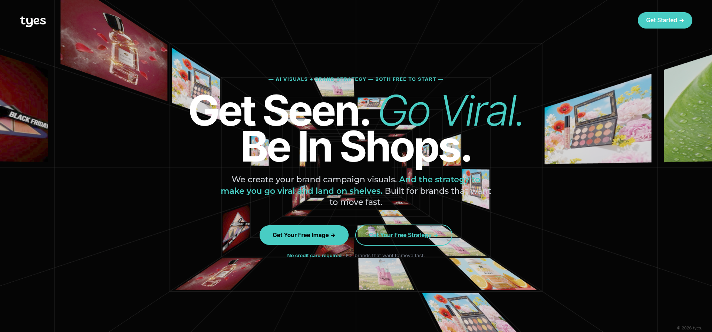
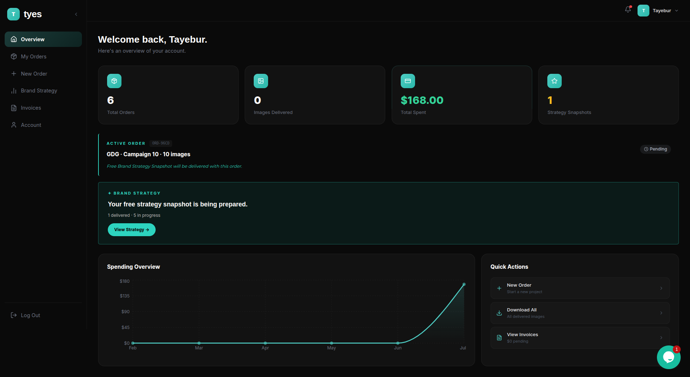

# Tyes - AI Visuals & Brand Strategy Platform

Tyes is a full-stack web application designed for brands to order and manage AI-generated product visuals and brand strategies. It features a modern, responsive Client Dashboard for customers to track their orders, spending, and invoices, alongside a secure Admin Dashboard for the team to manage clients and fulfillment.

## 📸 Project Previews

### Landing Page


### Client Dashboard


*(Note: Screenshots have been added!)*

---

## ✨ Key Features

### 🏢 For Clients
* **Sleek Client Dashboard:** A modern, dark-themed UI to oversee all brand assets.
* **Order Tracking:** Real-time visibility into AI visuals delivery and campaign snapshot progress.
* **Spending & Invoices:** Interactive charts mapping 6-month spending trends, alongside downloadable CSV invoices.
* **Secure Authentication:** Passwordless magic links and **Continue with Google** powered by Supabase.
* **Self-Serve Billing:** Fully integrated Stripe Customer Portal allowing clients to securely change their payment methods.

### 🛠️ For Admins
* **Admin Dashboard:** A centralized control panel to manage users, track total platform revenue, and process new orders.
* **Strategy Fulfillment:** Admins can review brand strategy requests and mark them as delivered.
* **Client Management:** View client tiers, spending, and toggle active/blocked account statuses.

### ⚙️ Core Engineering
* **Custom VAT Engine:** Dynamically calculates EU VAT based on the client's country and business status during checkout.
* **Real-time Database:** Built on PostgreSQL (via Supabase) with Row Level Security ensuring data privacy.
* **Responsive Data Viz:** Smooth, animated area charts using Recharts.

---

## 💻 Tech Stack

* **Frontend:** Next.js (App Router), React, CSS Modules / Inline Styles
* **Backend:** Supabase (Auth, PostgreSQL Database, Edge Functions)
* **Payments:** Stripe (Checkout, Customer Portal, Tax Rates)
* **Icons & Charts:** Lucide React, Recharts
* **Deployment:** Vercel

---

## 🚀 Getting Started

### Prerequisites
Make sure you have Node.js installed, as well as a Supabase project and a Stripe account.

### 1. Clone & Install
```bash
git clone https://github.com/TayeburRahman/tyes-website.git
cd tyes-website
npm install
```

### 2. Environment Variables
Create a `.env.local` file in the root directory and add your keys:
```env
# Supabase
NEXT_PUBLIC_SUPABASE_URL=your_supabase_url
NEXT_PUBLIC_SUPABASE_ANON_KEY=your_supabase_anon_key
SUPABASE_SERVICE_ROLE_KEY=your_service_role_key

# Stripe
STRIPE_SECRET_KEY=your_stripe_secret_key
STRIPE_PUBLISHABLE_KEY=your_stripe_pub_key
STRIPE_WEBHOOK_SECRET=your_webhook_secret

# Emails (Resend)
RESEND_API_KEY=your_resend_api_key

# URLs & Optional Configurations
NEXT_PUBLIC_SITE_URL=http://localhost:3000
NEXT_PUBLIC_CALENDLY_DEEPDIVE_URL=https://calendly.com/your-calendly-link
```

### 3. Run the Development Server
```bash
npm run dev
```
Open [http://localhost:3000](http://localhost:3000) with your browser to see the result.

---

## 📝 License
This project is proprietary and confidential.
