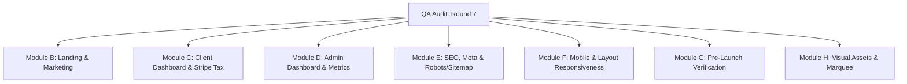

# tyes.app — Round 7 QA Audit Implementation Plan & Step-by-Step Prompts
**Date:** 6 August 2026  
**Source Document:** `docs/tyes_Round7_QA_5Aug_2.docx`  
**Target Document:** `docs/tyes_Round7_QA_5Aug_2.md`

--- -

## 📋 Overview

This document provides a comprehensive **Implementation Plan** and **Step-by-Step AI Prompts** based on the Round 7 QA Audit (conducted on 5 August 2026) for **tyes.app**.

The audit identifies critical pre-launch fixes, tax compliance issues (EU OSS / VAT), backend database sync bugs, admin filtering inconsistencies, SEO meta updates, mobile layout cleanups, and visual asset replacements.

---

# PART 1: Implementation Plan



---

## Module B: Landing & Marketing Pages

### B.1 Landing Splash Routing (`landing.html`)
- **Problem:** Buttons "Get Your Free Image" and "Get Your Free Strategy" open the auth modal instead of routing to `/main.html`. Dead header links (`href="#"`).
- **Fix:** 
  - Change hero action buttons to direct links: `<a href="/main.html" ...>` (remove `onClick` handlers).
  - Update nav links `Use Cases`, `Pricing`, `About` to point to `/main.html#use-cases`, `/pricing.html`, and `/about.html`.

### B.2 Homepage Section Spacing Unification (`main.html`)
- **Problem:** Inconsistent vertical padding across sections (e.g. 48px, 80px, 0px, 96px).
- **Fix:** Apply a global CSS rule ensuring all homepage sections use `padding-top: 90px; padding-bottom: 90px; margin: 0;` for desktop, and `padding-top: 60px; padding-bottom: 60px;` for mobile (`max-width: 700px`). Remove override classes like `paddingbottom-4` on `.hiw`.

### B.3 Typography Consistency (`pricing.html`)
- **Problem:** Main H2 heading on `pricing.html` renders in Inter 400 instead of League Spartan 800.
- **Fix:** Ensure `<link>` to Google Font `League Spartan` is present in `<head>`. Set `h1, h2, h3 { font-family: 'League Spartan', sans-serif; font-weight: 800; color: #FFFFFF; }`.

### B.6 Newsletter Wiring to Resend
- **Problem:** Newsletter input fields on `main.html` and `pricing.html` require live verification with Resend API.
- **Fix:** Connect newsletter form submission to Next.js API route `/api/newsletter` calling Resend `contacts.create` with Audience ID and welcome email flow.

---

## Module C: Client Dashboard & Stripe Tax Compliance

### C.0 Immutable Sequential Invoice Numbering
- **Problem:** Invoice numbers (`INV-0001`, `INV-0002`) are dynamically computed based on sorted row index, causing past invoices to renumber upon new orders.
- **Fix:** 
  - Store immutable `invoice_number` directly on the order record upon creation.
  - Pull sequence from database sequence (`INV-YYYY-XXXXX`) or directly from Stripe (`invoice.number`).
  - Sort client invoice tables by `created_at` or `invoice_number` ASC.

### C.0b & C.0c & C.0d Stripe Checkout Tax Sync & Reverse Charge Notice
- **Problem:** VAT IDs captured at checkout fail to sync into Supabase `orders` and `profiles`. Private EU consumers are not charged VAT.
- **Fix:**
  1. Enable `automatic_tax: { enabled: true }` and `tax_id_collection: { enabled: true }` in `stripe.checkout.sessions.create`.
  2. Configure prices with appropriate `tax_behavior` (`exclusive` or `inclusive`).
  3. Register EU OSS (Non-Union) registration `EU372101016` in Stripe Dashboard (Test & Live).
  4. In `checkout.session.completed` webhook:
     - Retrieve expanded `customer_details.tax_ids` and `invoice`.
     - Update Supabase `orders` with `amount_net`, `amount_vat`, `amount_total`, `buyer_country`, `buyer_vat_id`, `vat_treatment`, `invoice_number`, `invoice_pdf`.
     - Update `profiles` with `business_account: true` and `vat_id` if present.
     - Include required EU Reverse Charge text on invoices for B2B orders: *"Reverse charge — VAT to be accounted for by the recipient, Art. 196 Directive 2006/112/EC"*.

### C.1 PDF Invoice Download Link
- **Problem:** Invoices table missing download link.
- **Fix:** Add a download action column rendering `<a href={invoice.pdf_url} download target="_blank">Download PDF &darr;</a>`.

### C.2 Order Status Filter Alignment ("Pending" Orders)
- **Problem:** Orders with status `pending` are omitted from the "In Progress" filter chip.
- **Fix:** Update filter helper: `inProgress: o => ['pending', 'in_progress', 'in progress'].includes(String(o.status).toLowerCase())`.

### C.3 Retail Network Matrix by Brand Positioning
- **Problem:** Beauty / Premium brands show Mass Market Retail & Hyperstores as opportunities.
- **Fix:** Enforce `RETAIL_MATRIX` where Beauty & Premium categories only display `Premium Retail`, `Hyperpharmacies`, and `Marketplaces`.

### C.4 Dashboard Typography
- **Problem:** Dashboard H3 section titles render in Inter instead of League Spartan 800.
- **Fix:** Standardize H3 font styles in dashboard layout.

---

## Module D: Admin Dashboard & Metrics

### D.1 Order Status Normalization
- **Problem:** Filter chips hide paid orders due to database status string variations (`new`, `paid`, `awaiting`, `queued`, `pending`).
- **Fix:** Create a centralized `normalizeStatus(raw)` helper:
  - Maps `pending`/`new`/`paid`/`awaiting`/`queued` $\rightarrow$ `'pending'`
  - Maps `in_progress`/`processing`/`working` $\rightarrow$ `'in_progress'`
  - Maps `revision`/`revisions` $\rightarrow$ `'revision'`
  - Maps `delivered`/`completed`/`sent` $\rightarrow$ `'delivered'`
  - Apply `normalizeStatus` to filter chips, status badges, and counts.

### D.2 Final Order Status Consolidation
- **Problem:** System uses both "Completed" and "Delivered" inconsistently.
- **Fix:** Standardize on `'delivered'` as the single final order status visible to clients.

### D.4 Client Count Reconciliations
- **Problem:** Dashboard card shows 20 clients while Clients tab lists 19.
- **Fix:** Standardize SQL query across both tiles, filtering out deleted, unverified, or admin user accounts.

### D.5 Settings Team Members Card
- **Problem:** Card is an empty shell.
- **Fix:** Either implement Admin Team Member list & invite dialog, or conditionally hide the card until phase 2.

### D.6 Admin Minor Bug Fixes
- **Rounding Fix:** Campaign 10 package displays $4.50/image ($45 / 10) instead of rounded $5.
- **Analytics Avg Delivery Time:** Calculate `AVG(delivered_at - created_at)` over delivered orders.
- **Analytics Top Clients:** Exclude clients with $0 revenue and 0 orders.
- **Clients Table SPENT Column:** Default null/empty spending to `$0`.
- **Strategy Requests Loader:** Replace zero counts with skeleton/spinner component during initial query fetch.

---

## Module E: SEO, Social Sharing & Assets

### E.1 Open Graph & Meta Tags (`main.html` & `landing.html`)
- **Problem:** Metadata reflects old Webflow template text.
- **Fix:** Inject accurate title, meta description, canonical tags, `og:*` tags, and Twitter card meta tags into `<head>`:
  - Title: `tyes — Campaign visuals in hours. Brand strategy in days.`
  - Meta Description: `AI campaign imagery refined by design specialists, plus a free brand growth strategy. For brands that move fast. First image free.`
  - OG Image: `https://www.tyes.app/images/og-tyes.jpg` (1200x630px).

### E.2 Robots.txt & Sitemap.xml
- **Problem:** `/robots.txt` and `/sitemap.xml` return 404.
- **Fix:** 
  - Add `/public/robots.txt` allowing root and disallowing `/dashboard/` & `/auth`.
  - Add `/public/sitemap.xml` indexing `/`, `/main.html`, `/pricing.html`, `/about.html`, `/how-it-works.html`, `/contact-us.html`, and legal pages.

### E.3 Template Images & Alt Text Cleanups
- **Problem:** 6 template images (`template-img-02`, `03`, `04`, `06`, `09`) remain on `main.html`. Generic alt text used (`Template Image - Starpify...`).
- **Fix:**
  - Replace remaining template WebP images with official tyes campaign visuals.
  - Rename `Untitled-design-158.jpg` to descriptive filename (e.g. `tyes-skincare-hero.jpg`).
  - Provide descriptive `alt` tags for all images.
  - Assign distinct category images for Skincare, Fragrance, Haircare, and Supplements instead of repeating `case-img-01.png`.

---

## Module F: Mobile Optimization & Dashboard Responsiveness

### F.1 Media Query Breakpoint Alignment
- **Problem:** Mismatch between template breakpoints (`479 / 767 / 991`) and custom section breakpoints (`560 / 800 / 900 / 1000`).
- **Fix:** Standardize breakpoints across CSS stylesheets: `479px` (mobile small), `767px` (mobile), `991px` (tablet), `1200px` (desktop).

### F.2 CSS Deduplication
- **Problem:** `.hiw-grid` media rules injected 4 times.
- **Fix:** Consolidate redundant media query blocks into `globals.css` or main stylesheet.

### F.3 Dashboard Tables Horizontal Overflow
- **Problem:** Tables with 8–10 columns break mobile viewports.
- **Fix:** Wrap table elements in `<div className="w-full overflow-x-auto -mx-4 px-4"><table className="min-w-[720px] w-full">...</table></div>`.

---

## Module G: Pre-Launch Production Verification

### G.1 Stripe Live Credentials & Tax Registration
- Swap sandbox API keys for live keys (`pk_live_...`, `sk_live_...`).
- Add live Webhook endpoint secret.
- Register live EU OSS tax number `EU372101016`.
- Create live Price IDs with specified `tax_behavior`.

### G.2 End-to-End Functional Checks
- Perform real card transaction ($1 - $5 test order).
- Verify email flow (Resend confirmation, delivery notification, password reset).
- Test Google OAuth in incognito window.
- Verify Cookie banner consent & legal page footer links.

---

## Module H: Brand Marquee & Visual Assets

### H.1 Brand Marquee Logo Swap
- **Problem:** Logo strip displays dummy template brand names (Amsterdam, Delaware, Monaco, etc.).
- **Fix:** Replace template SVG/PNG logos with actual client brand logos, preserving seamless scroll loop animation.

---

# PART 2: Step-by-Step Prompt Suite

Below are the exact, sequential prompts to execute the implementation plan.

---

### 🔹 Prompt 1: Landing Page Button Routing & Section Spacing Fixes
```text
Task: Fix Landing Splash Page Routing and Homepage Section Spacing

Files to modify:
- public/landing.html
- public/main.html
- public/css/ (or main CSS file)

Instructions:
1. In public/landing.html:
   - Locate "Get Your Free Image" and "Get Your Free Strategy" hero buttons.
   - Remove onClick handlers calling window.openAuthModal().
   - Update both buttons to plain anchor tags with href="/main.html".
   - Update header navigation links (Use Cases, Pricing, About) from href="#" to href="/main.html#use-cases", href="/pricing.html", and href="/about.html".
2. In public/main.html and main CSS stylesheet:
   - Remove all custom section paddings and inline spacing overrides (such as paddingbottom-4 on .hiw).
   - Apply a unified section spacing rule:
     main > section, section.cats, section.use-cases, section.brands-marquee, section.hiw, section.section-home-retail-network, section#pricing, section.padding-global {
       padding-top: 90px !important;
       padding-bottom: 90px !important;
       margin-top: 0 !important;
       margin-bottom: 0 !important;
     }
     @media (max-width: 700px) {
       main > section, section.cats, section.use-cases, section.brands-marquee, section.hiw, section.section-home-retail-network, section#pricing, section.padding-global {
         padding-top: 60px !important;
         padding-bottom: 60px !important;
       }
     }
3. Verify that landing page navigation seamlessly transfers users to /main.html and homepage vertical section rhythm is uniform.
```

---

### 🔹 Prompt 2: Stripe Tax, Checkout Session & Immutable Invoice Sync
```text
Task: Implement Immutable Invoice Numbers, Stripe Tax, and EU OSS Webhook Sync

Files to modify:
- src/app/api/checkout/route.ts (or Stripe checkout endpoint)
- src/app/api/webhooks/stripe/route.ts
- Supabase SQL schema / migration scripts

Instructions:
1. Update Stripe Checkout Session configuration:
   - Set automatic_tax: { enabled: true }
   - Set tax_id_collection: { enabled: true }
   - Set billing_address_collection: 'required'
   - Enable invoice_creation: { enabled: true }
   - Ensure Stripe Prices have tax_behavior set ('exclusive' or 'inclusive').
2. Database Schema Updates:
   - Ensure orders table has columns: amount_net (numeric), amount_vat (numeric), amount_total (numeric), buyer_country (text), buyer_vat_id (text), vat_treatment (text), invoice_number (text UNIQUE), invoice_pdf (text).
3. Webhook Handling (checkout.session.completed):
   - Expand customer_details.tax_ids and invoice on retrieved session.
   - Extract vatId = customer_details.tax_ids[0]?.value.
   - Update order record with amount_net, amount_vat, amount_total, buyer_country, buyer_vat_id, vat_treatment (vatId ? 'reverse_charge' : 'standard'), invoice_number (from inv.number), and invoice_pdf (from inv.invoice_pdf).
   - If vatId is present, update user's profile with business_account: true and vat_id: vatId.
4. Invoice Generation:
   - Include legal notice on B2B invoices with valid VAT ID: "Reverse charge — VAT to be accounted for by the recipient, Art. 196 Directive 2006/112/EC".
   - Include seller details: SHEIKA SKINCARE LLC, Sheridan WY, EIN 33-1252908, EU OSS EU372101016.
```

---

### 🔹 Prompt 3: Client Dashboard Status Filters, Retail Network Matrix & Fonts
```text
Task: Update Client Dashboard Filters, Retail Matrix, PDF Download Link, and Typography

Files to modify:
- src/components/dashboard/ClientOrders.tsx (or equivalent client orders component)
- src/components/dashboard/BrandStrategy.tsx
- src/components/dashboard/InvoicesTable.tsx
- public/pricing.html

Instructions:
1. Client Orders Filter Fix:
   - Update order filter definition so that "In Progress" includes status 'pending':
     const FILTERS = {
       all: () => true,
       inProgress: o => ['pending', 'in_progress', 'in progress'].includes(String(o.status).toLowerCase()),
       revision: o => String(o.status).toLowerCase() === 'revision',
       delivered: o => String(o.status).toLowerCase() === 'delivered',
     };
2. Client Invoices PDF Download Action:
   - Add a download column in Invoices table rendering:
     <a href={invoice.pdf_url} download target="_blank" className="text-accent hover:underline text-sm font-semibold">Download PDF &darr;</a>
3. Retail Network Eligibility Matrix:
   - For Beauty and Premium brand positioning, filter visible retail channels so only Premium Retail, Hyperpharmacies, and Marketplaces are rendered (hide Mass Market Retail & Hyperstores).
4. Typography Audit on pricing.html & Dashboard:
   - Add League Spartan font stylesheet link to head of pricing.html.
   - Ensure H1, H2, H3 elements across pricing page and dashboard render with font-family: 'League Spartan', sans-serif; font-weight: 800;.
```

---

### 🔹 Prompt 4: Admin Dashboard Status Normalization, Metrics & Skeleton Loaders
```text
Task: Normalize Admin Order Statuses, Fix Dashboard Metrics, and Add Skeleton Loaders

Files to modify:
- src/components/admin/AdminOrders.tsx
- src/components/admin/AdminAnalytics.tsx
- src/components/admin/AdminClients.tsx
- src/components/admin/StrategyRequests.tsx
- src/components/admin/AdminSettings.tsx

Instructions:
1. Admin Order Status Normalization:
   - Implement single source of truth for status filtering:
     const normalizeStatus = (raw) => {
       const s = String(raw || '').toLowerCase().replace(/[\s-]+/g, '_');
       if (['pending', 'new', 'paid', 'awaiting', 'queued'].includes(s)) return 'pending';
       if (['in_progress', 'processing', 'working'].includes(s)) return 'in_progress';
       if (['revision', 'revisions'].includes(s)) return 'revision';
       if (['completed', 'complete', 'done', 'delivered', 'sent'].includes(s)) return 'delivered';
       return 'pending';
     };
   - Apply normalizeStatus to badge rendering, chip count calculation, and filter matching. Verify that sum of filter chip counts equals total orders count.
2. Client Count Alignment:
   - Reconcile query for Total Clients tile on Dashboard and Clients list page to return identical counts.
3. Admin Analytics Fixes:
   - Compute Avg Delivery Time as average of (delivered_at - created_at) over delivered orders.
   - Exclude 0-order / $0 revenue clients from "Top Clients by Revenue".
   - In Clients table, display "$0" for SPENT column when client order total is null/0.
   - Fix Campaign 10 unit price display to $4.50/image ($45 / 10).
4. Strategy Requests UI:
   - Replace "0" counters and initial "Loading requests..." state with a proper skeleton loader / spinner component.
5. Team Members Card:
   - Either populate Team Members admin list and invite modal, or hide card if feature is not active.
```

---

### 🔹 Prompt 5: Complete SEO, Meta Tags, Robots.txt & Sitemap Implementation
```text
Task: Update SEO Meta Tags, Open Graph Metadata, Robots.txt, and Sitemap.xml

Files to create/modify:
- public/main.html
- public/landing.html
- public/robots.txt
- public/sitemap.xml

Instructions:
1. In public/main.html and public/landing.html:
   - Update <title> to: "tyes — Campaign visuals in hours. Brand strategy in days."
   - Replace description tag with: "AI campaign imagery refined by design specialists, plus a free brand growth strategy. For brands that move fast. First image free."
   - Add canonical link: <link rel="canonical" href="https://www.tyes.app/">
   - Add full Open Graph & Twitter card metadata:
     <meta property="og:type" content="website">
     <meta property="og:site_name" content="tyes">
     <meta property="og:url" content="https://www.tyes.app/">
     <meta property="og:title" content="tyes — Campaign visuals in hours. Brand strategy in days.">
     <meta property="og:description" content="AI campaign imagery refined by design specialists, plus a free brand growth strategy. First image free.">
     <meta property="og:image" content="https://www.tyes.app/images/og-tyes.jpg">
     <meta property="og:image:width" content="1200">
     <meta property="og:image:height" content="630">
     <meta name="twitter:card" content="summary_large_image">
     <meta name="twitter:title" content="tyes — Campaign visuals in hours. Brand strategy in days.">
     <meta name="twitter:description" content="AI campaign imagery refined by design specialists, plus a free brand growth strategy. First image free.">
     <meta name="twitter:image" content="https://www.tyes.app/images/og-tyes.jpg">
2. Create public/robots.txt:
   User-agent: *
   Allow: /
   Disallow: /dashboard/
   Disallow: /auth
   Sitemap: https://www.tyes.app/sitemap.xml
3. Create public/sitemap.xml:
   - Include public pages: /, /main.html, /pricing.html, /about.html, /how-it-works.html, /contact-us.html, and legal pages. Exclude /dashboard and /auth routes.
```

---

### 🔹 Prompt 6: Image Replacement, Alt Text Optimization & Marquee Logo Update
```text
Task: Replace Template Images, Add Descriptive Alt Text, Rename File Assets, and Update Brand Marquee Logos

Files to modify:
- public/main.html
- public/images/ directory

Instructions:
1. Homepage Template Image Replacement:
   - Replace 6 remaining Webflow template images (template-img-02, template-img-03, template-img-04, template-img-06, template-img-09) on main.html with official tyes campaign visuals.
   - Rename generic image file Untitled-design-158.jpg to a descriptive SEO filename (e.g. tyes-campaign-hero-visual.jpg).
2. Alt Text Audit:
   - Replace all instances of alt="Template Image - Starpify Webflow Template" with descriptive context-aware alt text (e.g. alt="Skincare campaign visual created with tyes").
3. Use Cases / Category Image Deduplication:
   - Replace repeated case-img-01.png across Skincare, Fragrance, Haircare, and Supplements so each category has a distinct visual asset.
4. Brand Marquee Logos:
   - Replace template placeholder logos (Amsterdam, Delaware, Monaco, Springfield, Sweden, Umbrella) with actual tyes client logos in the scroll loop. Maintain duplication pattern for infinite looping.
```

---

### 🔹 Prompt 7: Mobile Responsiveness, Breakpoint Alignment & Table Containers
```text
Task: Align Responsive Breakpoints, Deduplicate CSS, and Add Mobile Scroll Containers to Dashboard Tables

Files to modify:
- public/css/ (main CSS files)
- src/components/dashboard/ (Client & Admin table components)

Instructions:
1. Breakpoint Alignment:
   - Align media queries across marketing pages and components to standard breakpoints: 479px, 767px, 991px, and 1200px to avoid layout mismatches between 992px and 1000px.
2. CSS Cleanup:
   - Locate and remove 4 duplicate instances of .hiw-grid media rules at max-width 1000px and 560px.
3. Mobile Dashboard Tables:
   - Wrap Orders, Clients, and Invoices tables in scroll containers to prevent mobile horizontal viewport overflow:
     <div className="w-full overflow-x-auto -mx-4 px-4">
       <table className="min-w-[720px] w-full">...</table>
     </div>
```

---

### 🔹 Prompt 8: Pre-Launch Production Verification & Stripe Go-Live Checklist
```text
Task: Conduct Pre-Launch Production Verification & Go-Live Setup

Instructions:
1. Stripe Live Mode Setup:
   - Switch Stripe environment variables to Live API keys (pk_live_..., sk_live_...).
   - Register live Webhook endpoint and set STRIPE_WEBHOOK_SECRET.
   - Re-create Stripe Prices in live mode with explicit tax_behavior ('exclusive' or 'inclusive').
   - Register EU Non-Union OSS tax number EU372101016 in Stripe Live Tax Settings.
2. End-to-End Order & File Delivery Flow:
   - Execute one real card payment ($1-$5) end-to-end.
   - Verify client upload brief -> admin delivery -> client revision request -> order completed workflow.
   - Verify transactional emails via Resend (order confirmation, file delivery notification, password reset, welcome email).
3. Authentication & Legal:
   - Test Google Sign-In in Incognito window (verify app name displays 'tyes' and user populates in Supabase profiles).
   - Test Newsletter subscription flow (confirm contact is added to Resend audience).
   - Confirm Cookie consent banner operates correctly for EU IPs and legal links are active in footer.
```

---

## 📌 Verification Checklist

| Module | Task | Status | Verification Criteria |
| :--- | :--- | :---: | :--- |
| **Module B** | Landing buttons routing | `public/landing.html` | ✅ Done |
| **Module B** | Landing page click interceptor | `public/landing.html` | ✅ Done |
| **Module B** | Section vertical spacing | `public/main.html` | ✅ Done (90px desktop / 60px mobile) |
| **Module B** | Pricing page typography | `public/pricing.html` | ✅ Done (League Spartan + Google Fonts) |
| **Module C** | Client order filter chips | `src/app/dashboard/client/page.jsx` | ✅ Done (`in_progress` includes `pending`) |
| **Module C** | Invoices table PDF link | `src/app/dashboard/client/page.jsx` | ✅ Done |
| **Module C** | Retail Matrix positioning rules | `src/components/dashboard/BrandStrategyHub.jsx` | ✅ Done (Beauty/Premium mapped cleanly) |
| **Module D** | Admin status normalization & metrics | [src/app/dashboard/admin/page.jsx](file:///home/tayebur/project/tyes-website/src/app/dashboard/admin/page.jsx) | ✅ Done |
| **Module D** | Admin Strategy Requests Responsive Layout | [AdminStrategyHub.jsx](file:///home/tayebur/project/tyes-website/src/components/dashboard/AdminStrategyHub.jsx) | ✅ Done |
| **Module D** | Table mobile horizontal scroll | `admin/page.jsx`, `client/page.jsx` | ✅ Done |
| **Module E** | SEO & Meta tags | `main.html`, `landing.html`, `pricing.html` | ✅ Done |
| **Module E** | Robots & Sitemap | `public/robots.txt`, `public/sitemap.xml` | ✅ Done |
| **Module H** | Brand marquee logos continuous animation | `public/main.html` | ✅ Done |
